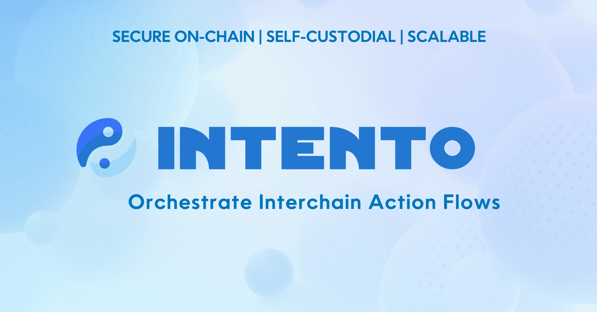

# Intento

With Intento, any action can be set anywhere at any time based on conditions, seamlessly bridging intentions with execution. Intento is a general purpose intent processing zone.

## What is Intento?

Intento is a protocol that revolutionizes on-chain processing of actions, through a custom Cosmos SDK module. It is designed to process and execute user intentions across IBC-connected chains, making on-chain processes more intuitive, accessible, and efficient. Intento covers a broad range of use cases, from simple scheduled payments to complex interchain operations.

## What is intent processing?

Intents contain actions and predefined conditions, which determine how actions are processed. In crypto, we want to process actions with no counterparty risk and in a permissionless and decentralized manner. This has so far only been possible by directly sending transactions to the destination chain. With Intento, you will be able specify your intent to perform any action, anywhere at any moment given any conditions.

## Key Features

- Full Non-custiodial Execution: Ensures a completely sovereign processing of your actions and conditions.
- Permissionless: Open for everyone.
- TriggerPortal: An easy to use frontend UI to submit actions
- Orchestration: Set execution for complex interchain operations.
- Scalable and VM Agnostic: Designed for compatibility of executing actions on various VMs (CosmWasm and EVM).
- IBC-Native: Set coordinated actions across blockchains using Interchain Accounts and IBC-hooks
- Modular and Secure: Utilizes Cosmos SDK, Dymension for settlement and Celestia for security.
- Privileged Execution: Execute actions on your account by granting permissions to a fixed trigger address.

## How Intento Works

Intento leverages a combination of the Cosmos stack and IBC to provide a seamless processing of intents experience. Users, developers and organisations can orchestrate complex sets of actions, ranging from simple automated payments to sophisticated interchain operations, all composed and executed from the Intento processing chain. By integrating with the IBC protocol on a deep level, Intento not only automates from within a single blockchain but also from and to different blockchains, offering a general purpose solution.

## Why Intento?

Intento is not just another processing of intents tool; it is a comprehensive solution designed to make blockchain operations effortless, secure, and efficient. With a focus on user intent, scalability, and interchain capabilities, Intento stands out as the most efficient and effective processing of intents solution in the Web3 ecosystem. Whether you're looking to manage portfolios, streamline payments, or coordinate across blockchains, Intento has you covered.

## Use Cases

Intento opens up endless possibilities for developers, DAOs and end-users alike, including but not limited to:

- Orchestrating assets across chains
- Scheduled payments and subscriptions
- Cross-chain portfolio management
- Auto-rebalancing indexes
- Trading strategies
- Autocompound operations
- Swap streaming
- Payroll services
- Scheduling governance proposals, tallying and executing proposals

## Gas Cost Comparison and Efficiency

Intento sets a new standard for efficiency, outperforming existing solutions that are off-chain, with low gas gas costs. This efficiency not only reduces costs for users but also broadens accessibility, introduces new use cases, and improves the overall user experience in the crypto ecosystem.

<!-- ## Fee model

Unlike bot networks, Intento excels by offering a chain-agnostic platform that performs processing on-chain, ensuring a secure, sustainable and scalable solution. Our modular stack enhances scalability, with a token specifically designed for action processing.

Beyond transaction fees, we've introduced a flexible, gas-based fee system. It's a usage based pricing model with cross-Subsidization. More advanced actions are charged more. This allows us to keep the initial price low and competitive. This ensures a sustainable, and scalable revenue model that grows with our platform. -->

## Learn more

<!-- [Intento documentation](https://docs.intento.zone)

Other useful links -->

[Intento main website](https://intento.zone/)
[TRST Labs website](https://trstlabs.xyz/)
[TriggerPortal - one stop action building tool](https://triggerportal.zone/)
[Cosmonaut GPT - your helping hand in building actions](https://chatgpt.com/g/g-cRhoPo6YH-cosmonaut/)

<!-- [Cosmos SDK documentation](https://docs.cosmos.network)
[Cosmos SDK Tutorials](https://tutorials.cosmos.network) -->
