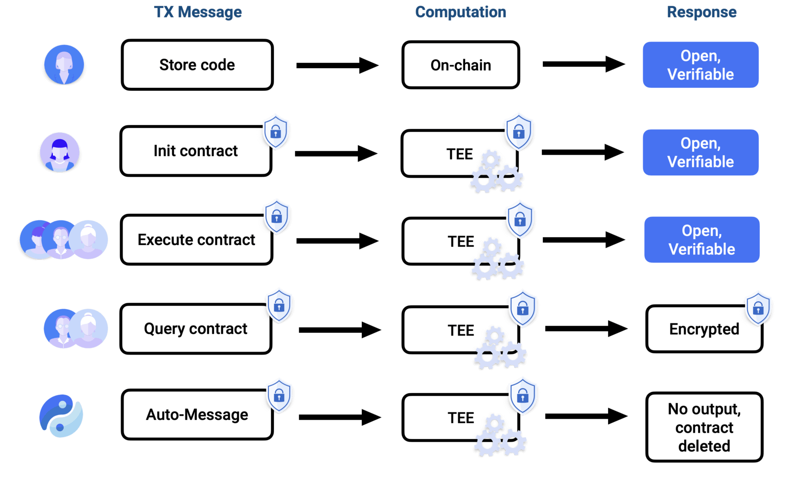

# Encryption

When developing Trustless Contracts it is important to understand what is private and what is public.

*A high-level overview of the transaction process for each message type is as follows:*

1. Inputs are encrypted and then sent to a blackbox environment
2. There, inputs are decrypted, you can alter the state, which is then stored in an encrypted way
3. The outputs are encrypted and sent back to the message sender. Aditinally open and verifiable logs can be made, for anyone to view. Developers cna build in privacy controls for users

    - The Automated message does not directly expose any transaction result as it is an internal transaction. It can update the public state, which can be viewed by anyone.

    *=Public state is to be stored on the blockchain forever

- Code template is stored, and Trustless Contract instances can be instantiated by anyone
- When instantiated, the contract will run for a set duration or forever.
- AutoMsg is called at a ceretain time or at predefined intervals
- Anyone can execute and query the contract, so as a developer. Through viewing keys, access can be granted to the account owner. Viewing keys can also be shared.

