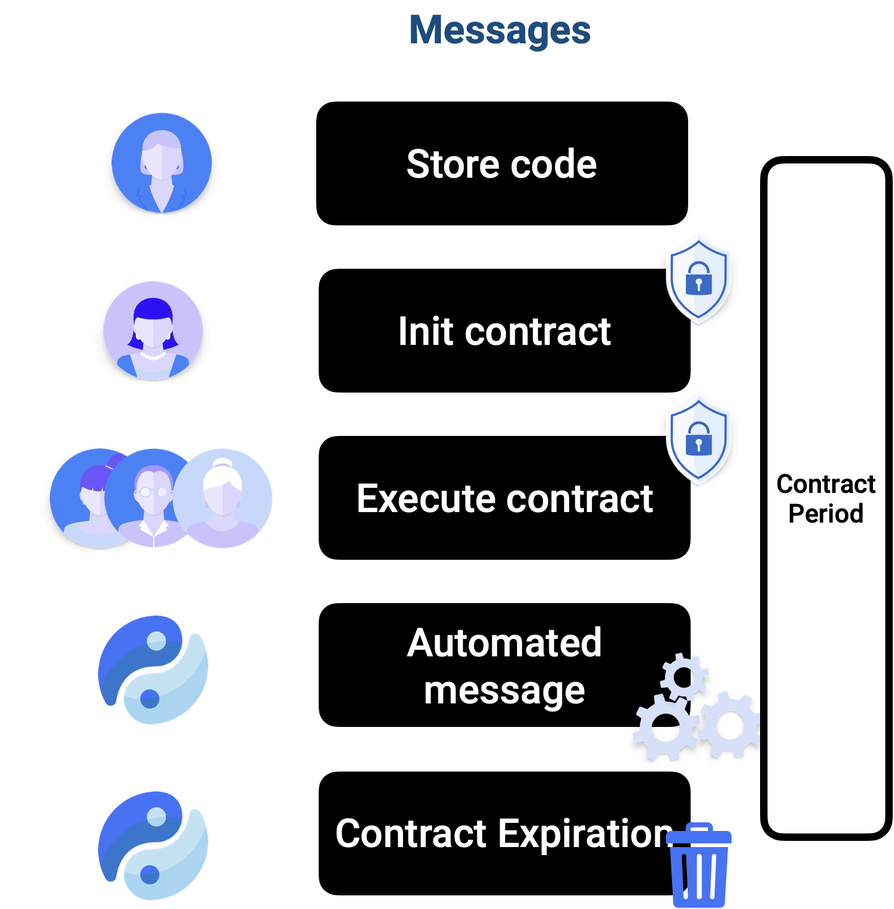

# Encryption

When developing Trustless Contracts it is vital to understand what is exposed and what is private.
With computation on the TEE, no other process or application is able to view or currupt the contents. Your inputs stay secure, and data is stored in an encrypted way.

*A high-level overview of the transaction process for each message type is as follows:*

1. Inputs are encrypted and then sent to the safe environment (TEE)
2. There, inputs are decrypted, the state is changed and then stored in an encrypted way
3. The outputs are open and verifiable, for anyone to view. Developers can program what is exposed. Hereafter, could know what the message did to the contract state (if desired). The Contract Result* is also updated.
    - For contract queries, the result is encrypted and can only be decrypted by the sender's account
    - The Automated message does not directly expose any transaction result as it is an internal transaction. However the Contract Result* is updated, and this can be viewed by anyone.

    *=Public state to be stored on the blockchain forever

*The following figure describes the duration of a Trustless Contract:*

- Code is stored, and instances (Trustless Contracts) can be created by anyone
- When instantiated, the contract will run for the set duration, then the AutoMsg is called before the contract gets expired
- Anyone can execute and query the contract, so as a developer, be sure to set specific rules in the functions 

