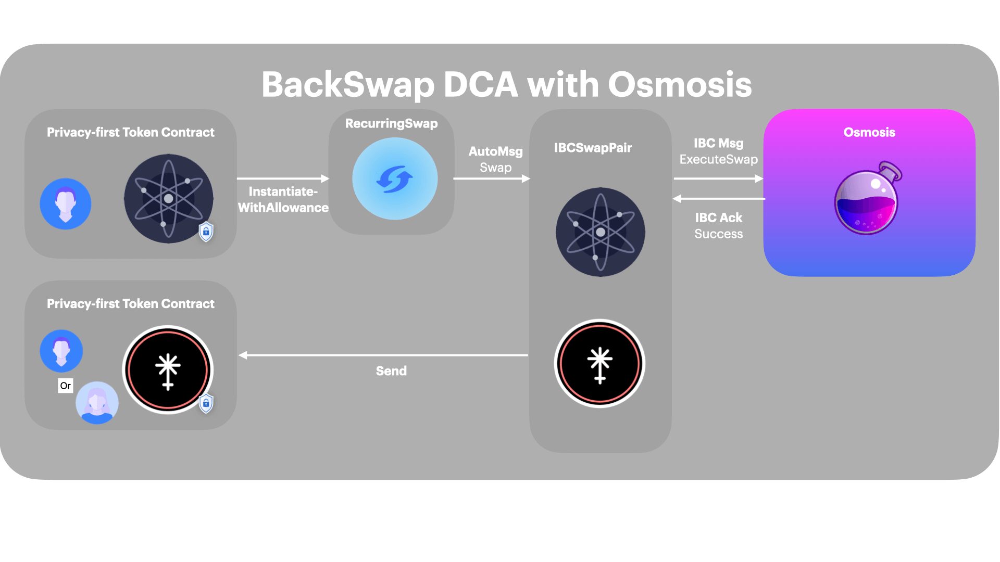

# IBC Contract Calls

Trustless Contracts extend their functionality to other chains. In the near future, DEXes, DAOs and other services can extend their functionallity by integrating with our predefined Trustless Contract templates. Below are examples for a number of use cases for IBC-enabled chains and contracts.

*A high-level overview of the transaction processes for interacting with IBC-enabled chains is as follows:*

### Integration with DEXes
1. Swapping to Osmosis, then getting back a TIP20 token. 

2. Dollar-cost averaging, or recurringly swapping, to Osmosis, then getting back a TIP20 token.

*IBC calls to public chains are public. The ExecuteSwap message type from TIP20 contract to SwapPair can be guessed based on gas. The receiver remains unknown to the public. The token received is privacy perserving meaning that the balance and transaction history is only viewable through a viewing key unless the owner explicitly sets its TIP20 account to public.*

### Payroll for DAOs
3. DAOs Distributing funds over a certain period of time

*IBC calls to public chains are public. The recurring transactions are auditable and viewable by admins. The balances are private by default and are acessable through viewing keys*

### Subscriptions
TODO

### General Recurring Execution
TODO

### Price-triggered swaps
TODO

### In-game battling with time-based winner appointment
TODO