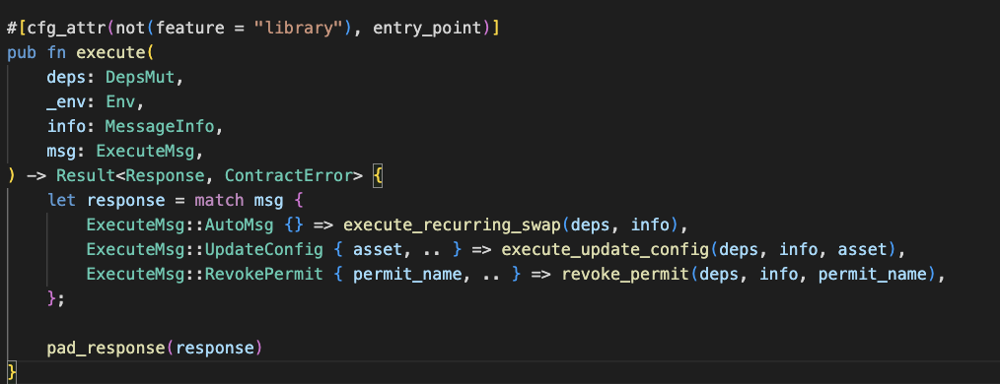

## Getting familiar with CosmWasm

On [Youtube](https://www.youtube.com/results?sp=mAEB&search_query=CosmWasm). there are many great tutorials on CosmWasm. 

[CosmWasm](https://docs.cosmwasm.com/docs/) provides extensive documentation.

## CosmWasm on Trustless Hub

CosmWasm is a smart contract standard within the Cosmos Ecosystem. Many chains including Juno, Osmosis, Terra, Secret Network, Stargaze and Archway use these to power safe and effient decentralized applications.  

CosmWasm code should be designed to be:
1) Stored
2) Instantiated 
3) Executed
4) Queried

And additionally for Trustless Hub they have:

5) An AutoMsg to execute 1-time or recurringly. This can defined in the CodeInfo or at Contract Instantiation

Points 1,2,3,4 are similar to develop as in other smart contract platforms. Encryption and privacy are enabled by the blockchain, and the developer can use the benefits of these.
For point 5, automatically executing code, an auto message should be defined. This can point to a user-executable function or to a function that can only be executed by the contract itself.

For your conveniance the message to call the function can be named *AutoMsg*. Naming it AutoMsg allows people viewing the contract code to be aware of the which part of the contract is to be run automatically.

Above, an example on the AutoMessage pointing to a function on a recurring swap Trustless Contract. 

#### How does this work?

After instantiating from the TIP20 token contract, the TIP20 token contract gives allowance to this contract for the max funds to swap. Trustless Hub then recurringly calls AutoMsg. 

## Differences in contract transactions with standard CosmWasm

### Executing 

Executing code is done by encrypting the message with the code hash and sender public key, so that the message can only be executed by the code it belongs to. 

The inputs are private and are only decrypted once the message is in the secure environment, where inputs are then securely executed. The TEE, that runs through Intel SGX, and is designed in such a way that no other process or application is able to view or currupt the contents. This safeguards your transaction. This is an important part of AutoExecution, as for a lot of applications users should be protected against misuse of their recurring strategy.

### Instantiating 

Instantiating contracts is similar to other CosmWasm contract platforms.

Next to Instantiate, you can define InstantiateAuto to AutoExecute. 
You can pass several optional fields to this function:

- AutoMessage
A JSON message similar to Execute. This should be encrypted at the frontend as it prevents front-running. 
- Duration 
Duration of the contract in [time](https://pkg.go.dev/time) (e.g. 60s/5h/7h40s/420h)
- Interval
interval of recurring execution. Should be shorter than duration.
- StartDurationAt
Time that AutoExecution should start
- Funds 
This is used for AutoExecution fees. This sends TRST to the instantiated proxy contract. This is used to deduct fees for the AutoExecution. Remaining balances are refunded given that *owner* is defined.
- Owner
An address to refund the contract balance to after AutoExecution ends. 

### Querying 

The contract can be queried through {RCP URL}/compute/v1beta1/contract/{contract_address}/smart/{query_data}. 

The query inputs are encrypted just as with executing code
The result of the query is always encrypted and only viewable by the person that performs the query by decrypting the result.

In addition, like with other CosmWasm contract instances, contracts can also query other contracts.
There is a limit to recursive queries to 10, which is not an issue for most, if not all, queries.

### Public State

Contracts can have a public state that is cheap to query. It is easy integrate and show users a way to view what is happening on the contract. The Contract State is can be queried through {RCP API URL}/compute/v1beta1/contract/{contract_address}/public-state. 
As a developer you save outputs to the public state when you make a new Response.

