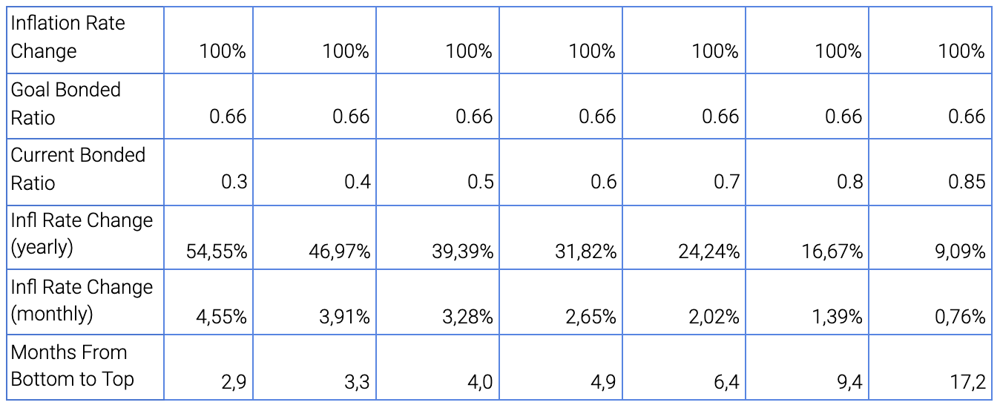

# Delegating Tokens

**Documentation for delegating TRST Tokens.**

Delegating tokens works in the same way like other Cosmos-based blockchains. Delegate your 'stake' to valitors using a wallet, like the [Keplr wallet](https://faq.keplr.app/), or alternatively you can use the Trustless Hub daemon. This process is similar accross Cosmos-based blockchains.

**Background**

In simple terms, the TPP token can be used to earn through staking or through transacting with the blockchain. On the ‘staking’ side, users lock up their tokens, and automatically earn rewards. On the ‘transaction’ side, users can earn tokens by selling and estimating items. Here, users can also buy items and trade TPP tokens for other tokens and vice versa.
Staking
Firstly, on the ‘staking’ side, token holders stake their tokens by delegating tokens to validators and earn tokens from each successful Trustless Transfer on TPP. On top of that, stakers earn inflation rewards. These come from transaction fees collected from TPP transactions, and newly minted TPP tokens. The protocol makes sure that the amount of TPP staked is always around 67%, which works the similar to the ATOM token. On TPP, the minimum yearly inflation is 7%. The inflation can change by up to 100% to a maximum of 107% (recalculated each block) , until the total staked amount is 67%. Once it is over 67% the inflation will slowly decrease back until the minimum 7%. Hence, the total staking rewards are flexible and depend on the amount of staked tokens, block time and the amount of inflation. The period for undelegating (unlocking) is currently 21 days, like the ATOM token. Governance proposals can alter these dynamics, the undelegation period may be altered, and the proposed inflation may be changed. Tokens that are not staked lose value over time, this is to make sure there are enough tokens staked, keeping the protocol secure.

## Using the daemon

First, install the [daemon](https://docs.trustlesshub.com/guide/install.html). 

Then run it on mainnet. 

Then delegate your tokens.

## To stake or not to stake?
Staking TRST tokens can become a great passive revenue stream, as it is contingent on inflation rewards and network growth. Learn more at [trustlesshub.com](https://trustlesshub.com).

