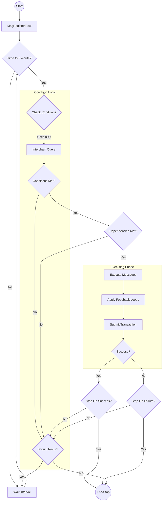
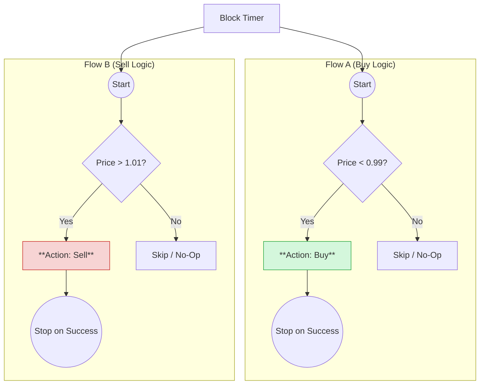
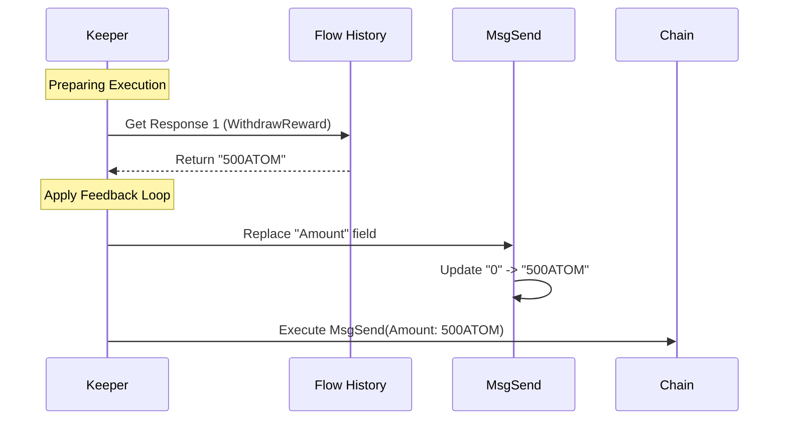

To design effective Intent-based Flows, it helps to visualize the execution lifecycle and understand common structural patterns. This guide provides diagrams and blueprints for standard and advanced flow architectures.

## Execution Lifecycle

Understanding how the Intento engine processes a flow is critical for debugging and optimization. The following diagram illustrates the decision loop for a recurring flow.

---

## Pattern 1: The Guardrail

**Goal:** Execute an action only when specific on-chain conditions are met.

*   **Use Case:** Buy token X only when its price drops below $Y.
*   **Structure:**
    *   **Interval:** Short (e.g., 1 minute).
    *   **Condition:** `PriceOracle < TargetPrice`.
    *   **Configuration:** `StopOnSuccess = True`.

This pattern checks the condition repeatedly. If false, it does nothing and waits. If true, it executes once and permanently stops.

---

## Pattern 2: The Loop (DCA)

**Goal:** Repeat an action periodically, regardless of external state.

*   **Use Case:** Dollar Cost Average (DCA) - Buy $100 of ETH every week.
*   **Structure:**
    *   **Interval:** 1 week.
    *   **Condition:** None (Always True).
    *   **Configuration:** `StopOnSuccess = False`, `StopOnFailure = False`.

---

## Pattern 3: The Branch (If/Else)

**Goal:** Execute Logic A if Condition X is true, otherwise execute Logic B if Condition Y is true.

Since a single flow executes linearly, branching logic is achieved by **Coupling Two Flows** running in parallel with mutually exclusive conditions.

*   **Use Case:** 
    *   If `DAI < 0.99` → Buy DAI (Arbitrage).
    *   If `DAI > 1.01` → Sell DAI (Arbitrage).

**Diagram:**

---

## Pattern 4: The Feedback Loop (Dynamic Data)

**Goal:** Use the result of a previous query or action as the input for the next action.

*   **Use Case:** Withdraw all available staking rewards (unknown amount) and send them to a cold wallet.
*   **Structure:**
    1.  **Msg 1:** `WithdrawDelegatorReward` (Response contains `Amount`).
    2.  **Feedback Loop:** Extract `Amount` from Msg 1 Response → Inject into Msg 2 `Amount` field.
    3.  **Msg 2:** `MsgSend` (Executes with the dynamic amount).

---

## Pattern 5: The Chain Reaction (Dependencies)

**Goal:** Execute Flow B only if Flow A has successfully executed.

*   **Use Case:** 
    1.  Flow A: Swap ATOM for OSMO.
    2.  Flow B: Provide Liquidity with the new OSMO.
*   **Structure:**
    *   **Flow A:** Normal configuration.
    *   **Flow B:** 
        *   `skip_on_failure_of: [Flow_A_ID]`. (If A fails or hasn't run, B skips).
        *   Alternatively: `stop_on_failure_of: [Flow_A_ID]` to permanently stop B if A fails.

This creates a sequential dependency graph without needing a single monolithic transaction.

---

## Pattern 6: The Composite Condition (AND/OR)

**Goal:** Execute action only when MULTIPLE conditions are met.

*   **Use Case:** Buy ETH if Price < $2000 **AND** Volume > 1M.
*   **Structure:**
    *   **Comparison 1:** Price < 2000.
    *   **Comparison 2:** Volume > 1M.
    *   **Configuration:** `use_and_for_comparisons: true`.

*   **Variant (OR):** Buy if Price < $2000 **OR** RSI < 30.
    *   **Configuration:** `use_and_for_comparisons: false`.

---

## Pattern 7: The Wallet Fallback (Gas Safety)

**Goal:** Ensure the flow continues executing even if the Flow Account runs out of gas fees.

*   **Use Case:** High-frequency trading where the dedicated flow wallet might be depleted, but the Master (Owner) wallet has funds.
*   **Structure:**
    *   **Configuration:** `wallet_fallback: true`.
    *   **Behavior:** If the Flow Account has insufficient fees, the system deducts fees from the User's main account (Owner) instead.

