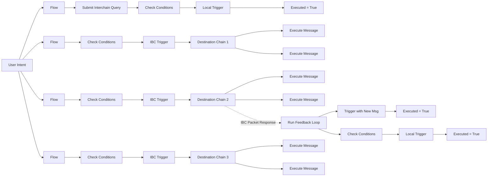
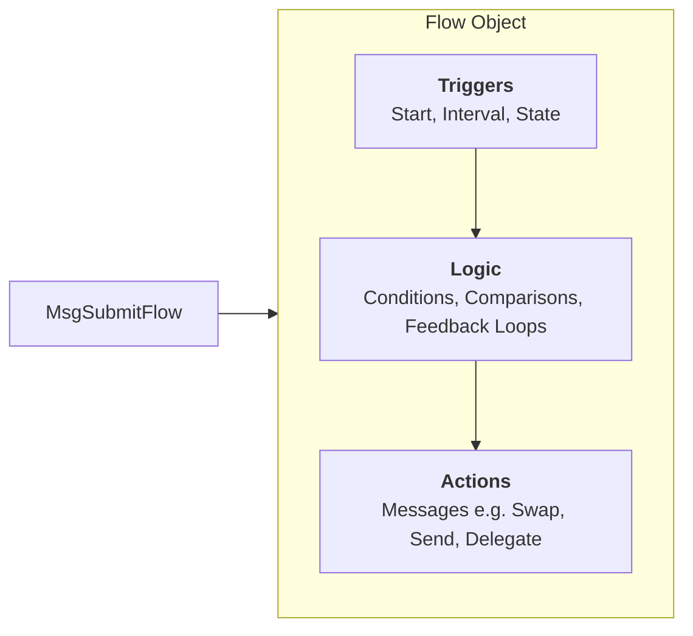
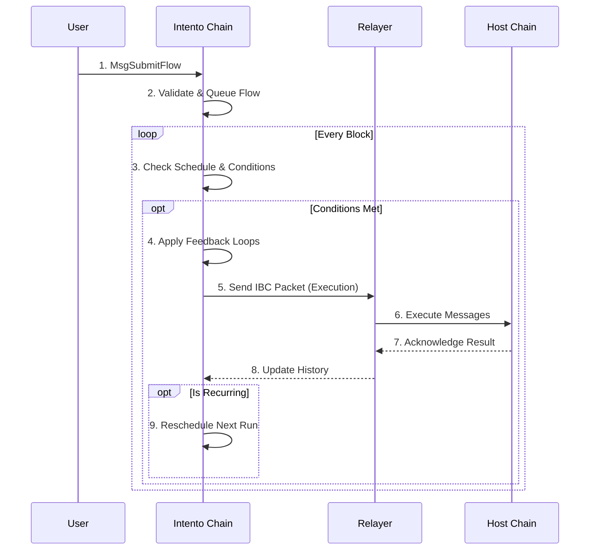

Intents contain actions and predefined conditions, which determine how actions are processed. In crypto, we want to execute actions with no counterparty risk and in a permissionless and decentralized manner. This has so far only been possible by directly sending transactions to the destination chain. With Intento, you will be able specify your intent to perform any action, anywhere at any moment given any conditions.

Intent-based action flows are submitted by providing an interval, duration, end time, and optional start time in a `MsgSubmitFlow`, IBC-specific settings such as the `ConnectionID` or a `TrustlessAgent`, and conditions such as comparisons and feedback loops.

A flow on Intento in technical terms is an object containing messages that are triggered at a specified time, or recurringly with intervals, with conditions such as feedback loops, stops and comparisons. Flow trigger entries are scheduled, and checked at the beginning of a new block.

### Flow Anatomy

A Flow is composed of three main layers: **Triggers**, **Logic**, and **Actions**.

Intento's Intents can execute actions on supported chains based on custom logic, making them extremely versatile and useful for a wide range of applications. With this, you can execute Cosmos SDK blockchain messages such as:

- `MsgSend` for token transfers
- `MsgSwapExactAmountIn` for token swapping on Osmosis
- `MsgWithdrawDelegatorReward` token reward claiming and auto compounding
- `MsgExecuteContract` to execute a CosmWasm contract
- `MsgInstantiateContract` to instantiate a CosmWasm contract

#### Approaches for Executing Messages on Supported Chains

Intento can execute messages on supported chains using several approaches:

1. **ICS20 Transfers with a Memo**
   - Easy to set up on available chains by using packet forwarding.
   - Memo field actions have limited support by chains.

2. **Trustless Agents**
   - **Best for:** Ease of use and gas abstraction.
   - **How:** Uses a distinct account on the host chain managed by an agent.
   - **Fees:** Handled by the agent (admin). User configures a fee limit.

3. **Self-Hosted Proxy Accounts**
   - **Best for:** Full control.
   - **How:**
     - **Cosmos (ICA):** You register an Interchain Account (ICA). Requires creating a port/connection. You must fund the ICA address on the host chain to pay for gas.
     - **EVM (Union):** You use your **Inferred Proxy Account**. No registration needed. You authorize execution via **Permits/Approvals** on the EVM chain.

To use Self-Hosted Proxy Accounts on Cosmos (ICA), you first register an interchain account. This involves creating a port ID and connection ID. You additionally have to send funds for fees on the host chain.

To use Union Proxy Accounts on EVM, simply derive your proxy address and ensure it has the necessary approvals (e.g., ERC-20 approvals) to execute the desired actions. No account creation transaction is needed.

## Execution Process

The following sequence details how a flow transitions from submission to cross-chain execution.

## MsgSubmitFlow

Submitting an flow with MsgSubmitFlow can be done with the following input:

| Field Name               | Data Type                           | Description                                                                                      | optional |
| ------------------------ | ----------------------------------- | ------------------------------------------------------------------------------------------------ | -------- |
| `Owner`                  | `string`                            | The owner of the flow                                                                            |          |
| `Msgs`                   | `repeated google.protobuf.Any`      | A list of arbitrary messages to include in the flow                                              |          |
| `Duration`               | `string`                            | The amount of time that the flow should run for                                                  |          |
| `Label`                  | `string`                            | A label for the flow                                                                             | ✔️       |
| `StartAt`                | `uint64`                            | A Unix timestamp representing the custom start time for execution (if set after block inclusion) | ✔️       |
| `Interval`               | `string`                            | The interval between automatic message calls                                                     | ✔️       |
| `FeeFunds`               | `repeated cosmos.base.v1beta1.Coin` | Optional funds to be used for transaction fees, limiting the amount of fees incurred             | ✔️       |
| `ConnectionID`           | `string`                            | The ID of the connection to use for a self-hosted ICA                                            | ✔️       |
| `HostConnectionID`       | `string`                            | The ID of the host chain connection to use for a self-hosted ICA                                 | ✔️       |
| `TrustlessAgent`         | `string`                            | Address of the Trustless Agent to use (optional)                                 | ✔️       |
| `TrustlessAgentFeeLimit` | `cosmos.base.v1beta1.Coin`          | A limit of the fees the Agent can charge per execution                           | ✔️       |
| `Configuration`          | `ExecutionConfiguration`            | Optional set of basic conditions and settings                                                    | ✔️       |
| `Conditions`             | `repeated Condition`                | Powerful set of conditions such as comparisons and feedback loops                                | ✔️       |

#### Notes

- When `Interval` is not provided, the end of the duration will be the time the flow executes.
- When `FeeFunds` are not provided, fees can be deducted from the Owner account by setting `WalletFallback` to true in `Configuration`.
- When `ConnectionID`, `HostConnectionID` and `TrustlessAgent` are not provided, it is assumed that `Msgs` are local messages to be executed on Intento.
- `TrustlessAgent` requires `TrustlessAgentFeeLimit`.

## Flow History

The `Flow History` captures the timeline and details of every executed flow and it's messages, providing transparency and accountability. By tracking scheduled times, actual execution times, outcomes, and errors, flows can be monitored and acted upon.

### Anatomy of an Flow History Entry

| **Field**             | **Description**                                                                                                    |
| --------------------- | ------------------------------------------------------------------------------------------------------------------ |
| `scheduled_exec_time` | Specifies the time at which the flow was originally scheduled for execution.                                       |
| `actual_exec_time`    | The time at which the flow was actually triggered. This provides insight into delays or on-time performance.       |
| `exec_fee`            | The fee incurred for executing the flow. This is represented as a `Coin` object and is non-nullable.               |
| `executed`            | A boolean flag indicating whether all messages within the flow were executed, regardless of the outcome.           |
| `timed_out`           | A boolean flag that specifies if the flow timed out during execution over IBC.                                     |
| `errors`              | A list of error messages encountered during the execution. If empty, the execution was successful.                 |
| `msg_responses`       | A collection of responses for the executed messages. This field remains empty if `save_responses` is set to false. |
| `query_responses`     | Contains responses to any queries performed. This field is also empty if `save_responses` is false.                |

<!-- _Continue reading on on how intent engine works in the [engine](@site/docs/engine/index.md) section of our documetation._ -->

<!-- ## Considerations

Intento's Intents are a powerful tool for automating actions over IBC. However, there are some limitations that should be taken into consideration when designing applications or protocols.

Ordered IBC channels are a necessary requirement for Interchain Automation with Interchain Accounts. This means that Intento's Intents can only be executed when the previous execution did not time out. Channels close when a chain is available but a packet times out. IBC Packets may time out, which can lead to failed actions. This can happen due to network congestion or other reasons, and can lead to a loss of funds or other negative consequences. To reduce the risk of this happening, Intento's Intents by default have a timeout equal to the interval, so that the impact is minimal.

Flows depend on the availability of relayers. If relayers are not actively relaying IBC transactions, Intento's Intents may fail or take longer to execute. It is important to keep this in mind when using Intento's Intents, and to ensure that there are active relayers available for reliable execution. -->
