# Intento vs Agents & MCPs

This document clarifies how Intento's architecture fundamentally differs from AI agents and Model Context Protocols (MCPs). Intento is designed as a deterministic, on-chain execution substrate, distinct from probabilistic reasoning systems.

## Key Distinctions

### Intento is not an agent

*   **No autonomous reasoning loop:** Intento does not "think" or make decisions based on probabilistic models.
*   **No model-driven decision-making:** Operations are executed based on strict, predefined logic, not LLM inference.
*   **No hidden execution logic:** All execution paths are visible and verifiable on-chain.
*   **Deterministic Execution:** Actions are user-defined and cryptographically constrained.

### User Intent vs Agent Behavior

| Feature | Intento (User Intent) | AI Agent |
| :--- | :--- | :--- |
| **Logic Source** | Explicitly declared by the user | Generated by a model (LLM) |
| **Execution** | Deterministic & Immutable | Probabilistic & Dynamic |
| **Predictability** | High (Exact set of instructions) | Variable (Can hallucinate or drift) |
| **Runtime** | On-chain protocol layer | Off-chain application execution |

**Intento executes explicitly declared intent:** All conditions, comparisons, feedback loops, and triggers are defined upfront by the user or the dApp. There is no dynamic goal interpretation or improvisation at runtime.

## Execution Model

Intento flows are stateful, on-chain, and inspectable. The protocol utilizes standard Cosmos SDK and IBC primitives to ensure secure execution:

*   **ICS (Interchain Security)**
*   **IBC (Inter-Blockchain Communication)**
*   **ICQ (Interchain Queries)**
*   **Authz (Authorization)**
*   **ICA (Interchain Accounts)** / **Proxy Accounts**

Execution rights are cryptographically constrained. Unlike agentic workflows that may require giving an LLM broad access to a wallet, Intento flows operate within strict, pre-approved permissions. No off-chain orchestration layer is required for correctness; the chain itself enforces the rules.

## Contrast with AI Agents

AI agents rely on probabilistic reasoning and external context to perform tasks. Their behavior can drift or change based on prompts, updated models, or new tools. Execution paths in agentic workflows are often opaque and non-reproducible.

**Intento favors predictability, replayability, and composability.** It provides the solid ground upon which agents can stand.

## Contrast with MCPs

Model Context Protocols (MCPs) and similar agent coordination layers operate at the **application layer**. They manage context windows, memory, and tool access for language models.

*   **MCPs:** Coordinate agents and tools off-chain.
*   **Intento:** Operates at the **protocol layer**.

Intento flows can be used *by* agents as a reliable tool, but Intento does not depend on agents to function.

## MCP in the Intento Stack

```mermaid
graph TD
    %% Off-Chain: User Authority
    User("👤 User<br/>(Intent Owner)")
    Keys("🔑 Keys / Wallet<br/>(Signer)")

    %% Off-Chain: AI Assistant
    Agent("🤖 AI Agent<br/>(Reasoning & Strategy)")
    MCP("MCP Interface<br/>(Tools & Context)<br/>(Read-only, Validation)")

    %% On-Chain: Protocol
    Intento("Intento Protocol<br/>(Deterministic Execution)")
    Chains("Blockchains<br/>(State / Msgs)")

    %% User <-> Agent <-> MCP
    User --> Agent
    Agent --> MCP
    MCP --> User

    %% Signing & Submission flow
    User --> Keys
    Keys --> Intento
    Intento --> Chains

    %% Feedback arrows
    Chains --> MCP
    Chains --> User

    %% Styles
    style User fill:#dfd,stroke:#333
    style Keys fill:#dfd,stroke:#333
    style Agent fill:#f9f,stroke:#333
    style MCP fill:#f9f,stroke:#333
    style Intento fill:#bbf,stroke:#333
    style Chains fill:#88c,stroke:#333


```

MCP fits into the Intento architecture as a **controlled interface layer** between AI agents and the protocol. Agents use MCP tools to inspect chain state, understand message types, and construct or validate Intento flow definitions. MCP provides structure and context, but does not hold execution authority or bypass protocol rules.

Intento remains the sole execution layer. All value-bearing actions are executed through on-chain, user-declared flows with explicit permissions and deterministic behavior. MCP and agents can propose, simulate, and explain actions, but they cannot improvise execution paths or act outside the constraints enforced by the protocol.

This separation allows Intento to safely support agent-driven workflows without inheriting the risks of probabilistic execution. Agents may evolve, prompts may change, and tooling may improve — Intento stays fixed as the execution anchor.

## Positioning: Infrastructure vs Reasoning

Intento is infrastructure for **intent execution**, not intent discovery. It complements AI agents rather than competing with them.

Think of Intento as the **"on-chain execution substrate"** and AI agents as an **"off-chain reasoning system"**.

*   **Use Intento when:** You need guaranteed, trustless execution of a specific sequence of actions (e.g., "If Price > X, Swap Token A for Token B").
*   **Use Agents when:** You need open-ended problem solving or data analysis (e.g., "Find the best yield farming strategy and set up the flows").
*   **Combine Both:** An agent analyzes the market, formulates a strategy, and submits it as a verified Intento flow for execution. This gives you the flexibility of AI with the security of a deterministic protocol.
