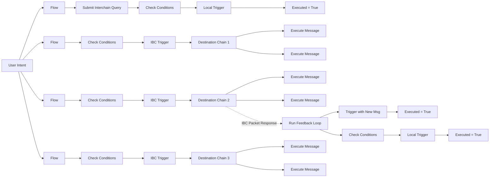

Intento's intent-based flow framework has been meticulously designed to execute transactions based on defined schedules, leveraging the blockchain's inherent security. This framework, devoid of reliance on external agents or smart contracts, utilizes custom BeginBlocker functions for flow executions. The integration with the IBC Interchain Accounts standard, permit the Intento chain to execute transactions across IBC-enabled chains without moving the assets out of the user's control.

```mermaid
flowchart LR
    %% Main Entry Points
    CometBFT[CometBFT] --> SDK[SDK Block]
    
    SDK --> BeginBlock[BeginBlock]
    SDK --> GenTx[General Transactions]

    %% Flow Queue Logic
    BeginBlock --> FlowQueue[/Flow Queue/]
    FlowQueue --> ICQCheck{No ICQ?}
    
    ICQCheck -- Yes --> SubmitICQ[Submit ICQ]
    SubmitICQ -. Response submitted by relayer .-> ConditionCheck
    
    ICQCheck -- No --> GetFlow[Get Flow]
    GetFlow --> ConditionCheck{Conditions?}

    %% Decision Logic
    ConditionCheck --> FeedbackCheck{Feedback?}
    
    FeedbackCheck -- Yes --> UseResponse[Use Response]
    UseResponse --> InterchainCheck
    
    FeedbackCheck -- No --> InterchainCheck{Interchain?}

    %% Execution and Destination
    InterchainCheck -- Yes --> ICAPacket[[ICA Packet]]
    InterchainCheck -- No --> LocalMsg[Local Msg]

    ICAPacket -.-> DestChain[(Dest Chain)]
    LocalMsg --> UpdateQueue[/Update Queue/]
    
    DestChain -. Ack/Timeout .-> UpdateQueue
```

Intento’s execution mechanism queues flows, checking them at the beginning of each block for their scheduled execution time. In the event of a blockchain halt, the system is designed to resume queued executions in subsequent blocks, ensuring reliability and continuity.
With Intento you can use the power of IBC for your user intents. You can use Interchain Queries (ICQ) and use their responses for comparisons and build feedback loops. Or use Interchain Accounts (ICA) to execute actions on connected chains. Below are just some of the examples of how flows can look like.

## CometBFT and Time Management

CometBFT, with its proposer-based timestamp mechanism, ensures a consistent and secure timestamping system for block creation. This approach mitigates risks associated with inaccurate timestamps, maintaining the blockchain's integrity. The adoption of precision and delay parameters among validators facilitates a synchronized agreement on the block timestamps, crucial for the orderly function of the blockchain.

## Conclusion

Intento’s architecture enables secure, scalable, and efficient execution of decentralized workflows. By integrating IBC, Intento provides a next-generation solution for cross-chain orchestration while maintaining self-custodial security. Intento is set to scale to support a wide range of chains and VMs, ensuring a robust and future-proof infrastructure for intent-based action flows.
