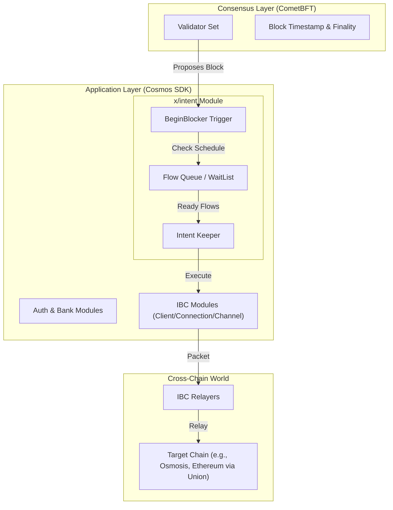
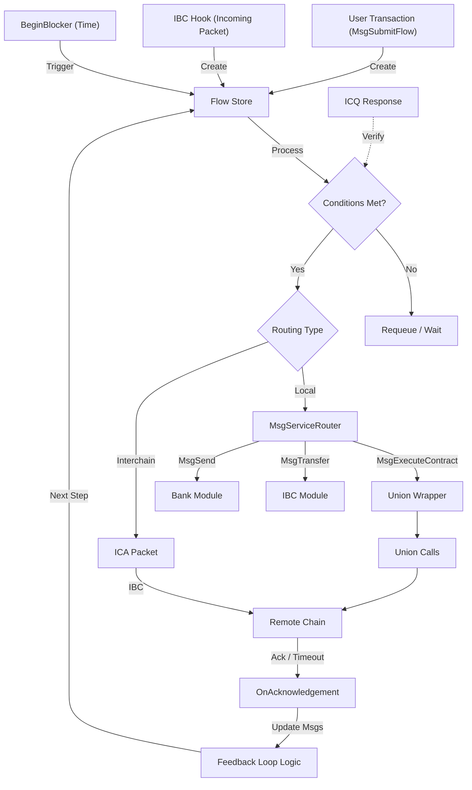

# System Architecture

Intento is a sovereign blockchain derived from the Cosmos SDK, designed specifically to orchestrate complex, asynchronous, and cross-chain workflows. At its core is the `x/intent` module, a specialized scheduling and execution engine that enables users to define "intents"—programmable actions that execute when specific conditions are met.

This document provides a high-level view of how Intento works, from the underlying consensus layer to the application logic that powers user intents.

## High-Level Overview

Intento operates on a standard CometBFT (formerly Tendermint) consensus engine, ensuring fast finality and security. The application layer is built using the Cosmos SDK, with the `x/intent` module serving as the central nervous system for all automation.

The architecture is designed to support:
-   **Asynchronous Execution**: Flows are not just executed immediately in a transaction but can be scheduled for future blocks.
-   **Cross-Chain Interoperability**: Deep integration with IBC (Inter-Blockchain Communication) allows Intento to act as a control center for accounts and assets on other chains.
-   **Conditional Logic**: Execution is gated by on-chain state, time, or even state from other chains (via Interchain Queries).

## The Intent Module (`x/intent`)

The `x/intent` module is the custom application logic that differentiates Intento from extensive general-purpose chains. It manages the lifecycle of every "Flow"—a set of instructions that makes up a user's intent.

For a deeper dive into the core concepts, see [Intent Concepts](../concepts/intent.mdx).

### Flow Lifecycle

The lifecycle of a flow involves submission, queuing, validation, and execution.

1.  **Submission**: A user submits a `MsgSubmitFlow` transaction. This message contains the actions to execute, scheduling parameters (start time, interval), and conditions.
    *   *See [Parameters](../reference/intent-engine/parameters.md) for details on flow configuration.*

2.  **Scheduling & Queueing**: If the flow is valid, it is added to the module's internal store. The `BeginBlocker` function runs at the start of every block to check if any flows are due for execution based on their `EndTime` or `Interval`.

3.  **Condition Check**: Before execution, the module evaluates any associated conditions. This might involve checking local account balances or verifying data returned from an Interchain Query (ICQ).
    *   *See [Conditions](../concepts/conditions.mdx) for logic available during execution.*

4.  **Execution**:
    *   **Local**: If the flow is local, messages are wrapped and executed via the standard Cosmos SDK `MsgServiceRouter`. This includes standard module interactions (e.g., specific `x/bank` sends) as well as initiating cross-chain transfers via the local IBC module (e.g., `MsgTransfer`).
    *   **Interchain**: If the flow targets another chain, the module constructs an IBC packet (usually controlling an Interchain Account) and efficiently sends it out.

### State Management

Flows are indexed by ID and strictly associated with their creator. The module maintains efficient data structures to quickly retrieve:
*   Active flows pending execution.
*   Flows waiting for a specific time window.
*   Results of previous executions (for flows with feedback loops).

## Cross-Chain Architecture

Intento is built to be a cross-chain orchestrator. It uses standard IBC protocols and next-generation interoperability layers like Union to interact with the wider ecosystem.

### Proxy Accounts

Intento uses **Proxy Accounts** to execute actions on remote chains. Instead of moving assets to Intento, users control an account on a host chain (like Osmosis, Neutron, or Arbitrum) *from* Intento. The `x/intent` module sends instructions to the host chain, where they are executed as if the user signed them locally.

There are two main types of Proxy Accounts:

1.  **Interchain Accounts (ICA)**: Standard Cosmos SDK implementation. Requires an explicit registration step. Used primarily for Cosmos chains.
2.  **Union Proxy Accounts**: Used for EVM chains (e.g., Ethereum, Arbitrum, Base) connected via Union. These are **inferred** (deterministically derived from your Intento address), so **no account creation is required**.

### Union (UCS03)

Union provides a zero-knowledge–based interoperability layer that enables secure cross-chain messaging without trusted relayers. Intento integrates with Union’s UCS03 (ZKGM) protocol.

**EVM Integration**: 
When targeting EVM chains, Intento utilizes Union Proxy Accounts. Since these accounts are deterministic, users can immediately start executing flows. However, executing actions on the destination chain requires **Permits** or **Approvals** (EIP-2612 or standard ERC-20 approvals) to allow the proxy to spend assets. Make sure to sign the necessary approvals on the target EVM chain before submitting flows.

## Security & Authentication

### Authentication & Delegated Execution
Intento supports advanced authentication mechanisms to allow for flexible yet secure automation. Users can delegate execution rights to **"Trustless Agents"**—specialized accounts that can pay for fees and execute flows on behalf of the user without having full custody of the user's main assets.

*   *See [Authentication](../reference/intent-engine/authentication.md) for details on permissions and agents.*

### Consensus & Timestamps
CometBFT provides the secure timestamping mechanism required for time-based intents. Since the `BeginBlocker` relies on strictly increasing block times, Intento guarantees that scheduled flows are executed as close to their target time as the consensus allows, without relying on centralized off-chain keepers.

## Integration & Observability

For teams looking to integrate with Intento, the platform provides standard Cosmos SDK interfaces and emitted events for tracking flow status.

### Interfaces
*   **gRPC / REST**: Full state querying of flows, params, and authentication status.
*   **CometBFT RPC**: For subscribing to block results and transactions.

### Event Stream
The `x/intent` module emits specific typed events that external systems can index to track the lifecycle of a flow. Key events include:
*   `flow-created`: Emitted when `MsgSubmitFlow` is successful.
*   `flow-triggered`: Emitted by `BeginBlocker` when a flow attempts execution.
*   `flow-msg-response` / `flow-msg-timed-out`: Emitted after execution to indicate success or failure.
*   `flow-error`: Emitted if a condition check or execution fails.
