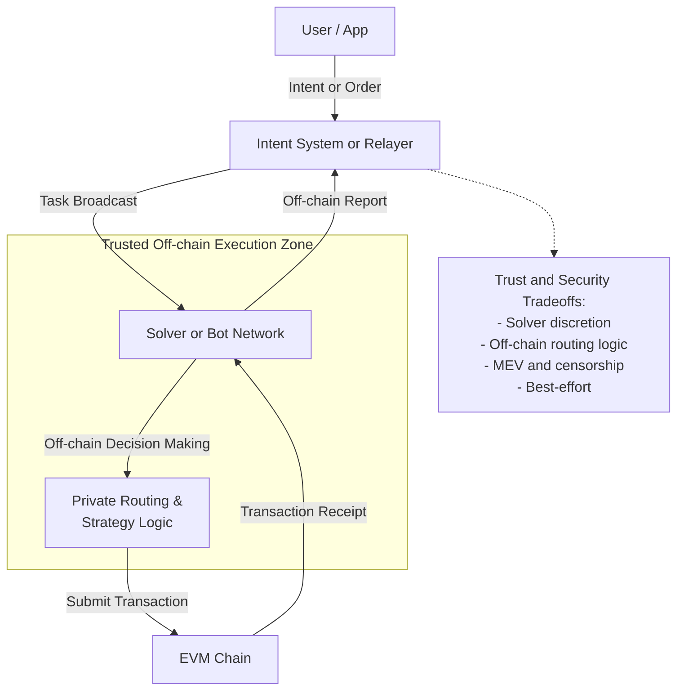
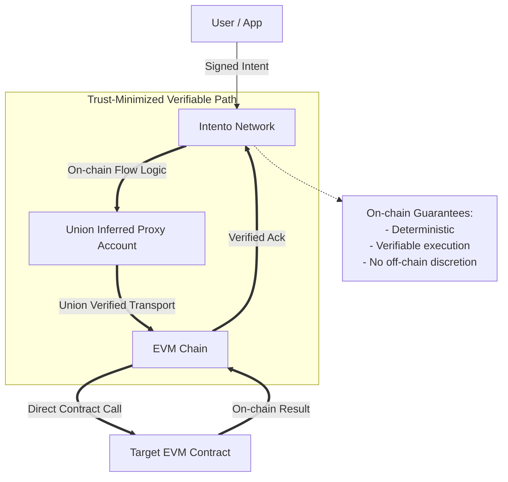

Intento enables **intent-based flows without application smart contracts**, providing protocol-level orchestration for automated, self-custodial, and scalable execution. Unlike traditional automation systems that rely on bot networks, solvers, or privileged application contracts, Intento moves orchestration itself on-chain — making flow logic, execution authority, and recovery part of the protocol rather than off-chain infrastructure.

This shifts the source of truth for automation from off-chain actors and application-level VMs to a verifiable, on-chain orchestration layer.

### The Problem with Existing Approaches  

#### Bot Networks

Bot and solver networks coordinate off-chain agents to fulfill intents. While flexible, this model introduces fundamental limitations:

* **Solver Discretion** – Execution strategy, routing, and timing are controlled by off-chain actors.
* **Additional Trust Assumptions** – Users must trust solvers to act correctly and report honestly.
* **MEV and Censorship Risk** – Off-chain execution increases exposure to reordering, withholding, and selective execution.
* **Limited On-chain Composability** – Execution logic is not part of the on-chain state machine.

##### Chainlink vs Intento for Event Automation

Existing solutions like Chainlink automate based on triggers, but they differ in scope and capability. Chainlink is primarily a **trigger and oracle network**: it monitors conditions and calls smart contract functions when those conditions are met. It is well-suited for single-step automation like rebases, upkeep, or cron-style jobs, but it cannot manage multi-step workflows, maintain state, or orchestrate actions across multiple chains or protocols.

Intento, in contrast, is a **cross-chain orchestration and intent-execution platform**. It enables users to define multi-step, conditional workflows that execute across chains and protocols, maintain state, and adapt over time using feedback loops. Instead of just signaling that an event occurred, Intento decides *what happens next*, allowing for fully autonomous flows such as streaming swaps, auto-compounding, or multi-protocol DeFi strategies.

| Capability                  | Chainlink | Intento |
| --------------------------- | --------- | ------- |
| Simple triggers             | ✅         | ✅       |
| Time-based jobs             | ✅         | ✅       |
| Condition checks   | ✅         | ✅       |
| Cross-chain execution       | ❌         | ✅       |
| Multi-step workflows        | ❌         | ✅       |
| Stateful long-running flows | ❌         | ✅       |
| User intent abstraction     | ❌         | ✅       |
| Feedback loops              | ❌         | ✅       |
| Protocol orchestration      | ❌         | ✅       |
| Agent-like behavior         | ❌         | ✅       |

#### Custom Smart Contracts

Privileged application smart contracts on CosmWasm and EVM chains can schedule or automate execution, but this shifts orchestration into application-level VMs:

* **Higher Gas Costs** – VM-based orchestration incurs persistent execution overhead.
* **Static Computational Overhead** – Costs scale with VM execution, not orchestration complexity.
* **Blockspace Competition** – Time-based or automated execution competes with general transactions.
* **Expanded Attack Surface** – Privileged contracts increase protocol and user risk.

### Source of Truth: How Intento Solves This

Intento moves orchestration itself on-chain at the protocol layer. Flow state, conditions, retries, and execution authority are enforced by the network, not by off-chain agents or application-level smart contracts.

This makes Intento a control plane for execution, not just an intent interface.

* **Protocol-Level Orchestration** – Flow logic is part of the chain state machine.
* **User-Owned Execution** – Users retain direct control over execution authority via protocol-derived accounts.
* **Deterministic Flows** – Conditions, comparisons, and feedback loops are enforced on-chain.
* **Native Recovery & Retries** – Failed steps can be retried or recovered as part of protocol logic.
* **Reduced Trusted Computing Base** – Trust is minimized to the underlying chains and transport protocols.

### Cross-Chain Execution Model

Intento executes cross-chain flows via protocol-derived execution identities:

* **Union Inferred Proxy Accounts** for verified EVM execution via Union transport.
* **Interchain Accounts (ICA)** for native Cosmos-based execution.
* **Interchain Queries (ICQ)** for reading cross-chain state as part of flow conditions.

This enables secure, verifiable cross-chain execution without relying on off-chain relayers or solver discretion.

### Intents: NEAR, ATOM, and Intento

NEAR Intents and emerging ATOM intents primarily focus on intent submission and solver-based fulfillment, where off-chain agents determine how to execute user intents and submit transactions on the user’s behalf. This model optimizes for routing flexibility but places execution authority and strategy off-chain.

Intento takes a fundamentally different approach by compiling intents into deterministic, verifiable on-chain state machines. Orchestration logic, execution control, and recovery are enforced by the protocol itself using protocol-derived accounts. This removes solver discretion from the critical path and makes intent execution natively composable with other on-chain systems.

In practice, Intento is not just an intent system — it is an orchestration layer for trust-minimized, cross-chain execution.

### How Intento Differs from Anoma & Agoric

#### Anoma (Intent Matching vs Protocol-Level Execution)

Anoma focuses on intent discovery, matching, and coordination across a decentralized network.

* Anoma specializes in intent matching and counterparty discovery.
* Intento specializes in protocol-level execution and orchestration.

Intento does not depend on matching networks to fulfill intents. Instead, it directly executes user-owned flows via on-chain orchestration, providing deterministic execution without relying on off-chain matching or fulfillment layers.

#### Agoric (Application Orchestration vs Protocol Orchestration)

Agoric provides powerful tools for building application-level orchestration inside smart contract environments.

* Agoric is optimized for building complex application-specific workflows.
* Intento is optimized for protocol-level, user-owned orchestration without per-application smart contracts.

Intento removes the need for developers to manage remote accounts, async VM logic, and timer-based orchestration inside application contracts by moving orchestration into the protocol itself.

### Network Architecture

* **Composable Orchestration Graphs** – Flows become reusable, composable primitives across protocols.
* **Permissionless Hosting** – Any integrator can run Trustless Agents and monetize execution while preserving non-custodial guarantees.
* **Protocol-Level Value Capture** – Execution, orchestration, and recovery become native protocol services.

### A New Standard for Intent-Based Execution

Intento establishes a new category of infrastructure: protocol-level orchestration for intent-based execution.

By moving execution control, flow logic, and recovery on-chain, Intento enables automation that is more secure, more composable, and more scalable than solver-based or contract-based systems.

Intento is not an interface for intents. It is the orchestration layer for trust-minimized, cross-chain execution.
