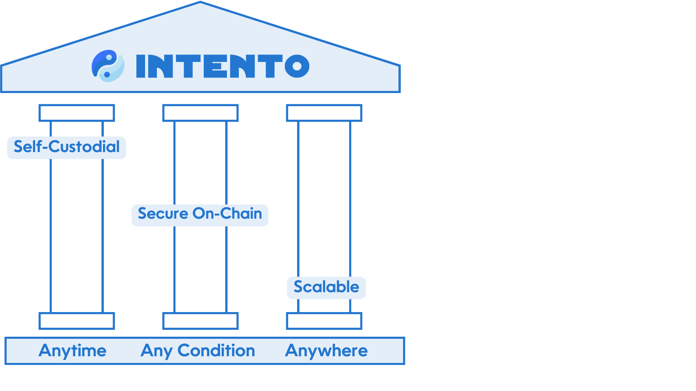

import { PlainVar } from '@site/src/js/Var';

With Intento, any action can be set anywhere at any time based on conditions, seamlessly bridging intentions with execution. Intento is the blockchain for secure, self-custodial and scalable orchestration of intent-driven actions across any blockchain using real-time inputs, on-chain.

## What is Intento?

Intento is a protocol that revolutionizes on-chain orchestration of actions, through a novel Cosmos SDK module. It is designed to process and execute user intentions across IBC-connected chains, making on-chain processes more intuitive, accessible, and efficient. Intento covers a broad range of use cases, from simple scheduled payments to complex interchain operations.

## Processing of intent-based actions via Flows

Intents contain actions and predefined conditions, which determine how actions are processed. In crypto, we want to orchestrate actions, or `flows`, with no counterparty risk and in a permissionless and decentralized manner. This has so far only been possible by directly sending transactions to the destination chain. With Intento, you will be able specify your intent to perform any action, anywhere at any moment given any conditions.

## Key Features

- Self-custiodial Execution: a completely sovereign processing of your actions and conditions.
- Permissionless: Open for everyone.
- [TriggerPortal](./intents/TriggerPortal): An easy to use frontend UI to submit flows
- Orchestration: Specify complex interchain operations.
- Scalable and VM Agnostic: Compatibility of executing actions on various VMs.
- IBC-Native: Coordinated actions across blockchains using Interchain Accounts and IBC-hooks
- Modular and Secure: Utilizes Cosmos SDK and Celestia DA for security.
- Privileged Execution: Execute actions on your account by granting permissions to a fixed and unique trigger address.

## Why Intento?

Intento is a comprehensive solution designed to make blockchain operations effortless, secure, and efficient. With a focus on user intent, scalability, and interchain capabilities, Intento stands out as the most efficient and effective processing of intents solution in the Web3 ecosystem. Whether you're looking to manage portfolios, streamline payments, or coordinate across blockchains, Intento has you covered.

Intento leverages a combination of the Cosmos stack and IBC to provide a seamless experience for workflows. Users, developers and organisations can orchestrate complex sets of actions, ranging from simple automated payments to sophisticated interchain operations, all composed and executed from the Intento processing chain. By integrating with the IBC protocol on a deep level, Intento not only automates from within a single blockchain but also from and to different blockchains, offering a general purpose solution.

Find out more about use cases in the [use cases section](./background/use-cases).

The strength of Intento is within the pillars above. These pillars not yet achieved in current automation solutions and these pillars make Intento uniquely positioned as the best workflow solution for DeFi.

1. **Self-Custodial**
By utilizing programmed accounts on a flow level, Intento enables fully self-custodial execution in a secure manner. This ensures a completely sovereign processing of your actions and conditions. By unlocking self-custody, we enhance security, transparency, and trust, allowing users to execute their intentions confidently and autonomously. With Intento, your blockchain experience is not just about participation, it's about freedom and sovereignty.
2. **Secure on-chain**
On-Chain submission, triggering and processing highlights our dedication to enabling seamless and secure execution of actions across multiple blockchain networks. By leveraging the Inter-Blockchain Communication (IBC) bridging protocol, Intento empowers users to trigger actions effortlessly with any chain, ensuring that every transaction is executed securely and reliably. This capability not only enhances interoperability but also fosters a more cohesive blockchain ecosystem
3. **Scalable**
At Intento, scalability is a cornerstone of our design. Our scalability ensures that as your needs grow, the platform can effortlessly adapt, empowering you to execute transactions and manage assets with confidence and efficiency, no matter the blockchain landscape. Intento sets a new standard for efficiency in the blockchain space, making it scalable through its innovative approach that outperforms existing off-chain solutions with significantly lower gas costs. For more information on gas cost calculations associated with Intento read about [our differentiation](./background/differentiation).

## Learn more

<!-- [Intento documentation](https://docs.intento.zone)

Other useful links -->

- [Intento website](https://intento.zone/)
- [TriggerPortal - one stop flow building tool](https://triggerportal.zone/)
- [Block Explorer](https://explorer.intento.zone/)
- [TRST Labs website](https://trstlabs.xyz/)
- [Cosmonaut GPT - your helping hand in building intent-based flows](https://chatgpt.com/g/g-cRhoPo6YH-cosmonaut/)
