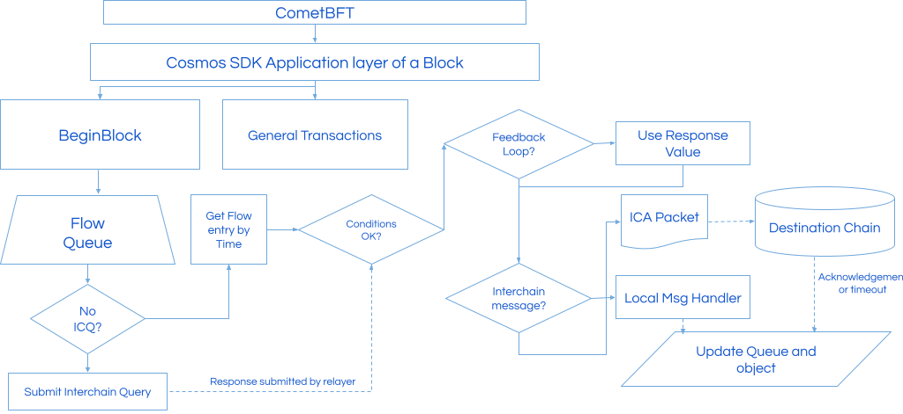

# Technical Background

This section will provide a technical overview of the Intento blockchain, including its architecture, consensus mechanism, block structure, network topology, automation solutions, and other relevant details.

## Architecture

Intento is built on top of the Cosmos SDK, which provides a modular and flexible framework for building customized blockchains. Intento uses the CometBFT (previously Tendermint) Proof of Stake (PoS) consensus algorithm, which is a Byzantine Fault Tolerant (BFT) consensus algorithm. This algorithm enables fast block times and ensures finality of transactions. CometBFT uses a leader-based approach, in which validators take turns proposing and verifying blocks.
Each block in Intento contains a set of transactions, which are validated by the network's validators. The blocks are structured in a Merkle tree format, which allows for efficient verification and storage of block data. Initially, block times are set to the Cosmos default of 5 seconds. As seen on other chains, block times can be set as low as 0.8 seconds. Having fast finality allows end users to have a seamless experience. 
Intento is designed to be highly scalable and interoperable with other blockchains. It achieves this through the IBC protocol, which enables secure and fast communication between different blockchains. This allows Intento to connect to other Cosmos chains and also to non-Cosmos chains in a trustless manner.

## On-chain Automation

Because Intento performs automation on-chain, the caller of the execution is the blockchain itself. Time-based execution is a feature that enables an entity such as a user smart contract, or blockchain, to execute based on a defined schedule. Cosmos blockchains rely on time-based execution for governance, staking, and other features. While time-based execution is a relatively simple concept, major smart contract platforms, including Ethereum, do not currently support it due to security concerns related to block time-stamps, and concerns about spam transactions and network congestion. Intento aims to address these concerns by having a dynamic set of parameters built-into the chain, which can be altered by governance.

Unlike current solutions such as bot networks, Intento leverages the security of the blockchain and uses custom BeginBlocker functions to execute time-based (trans)actions. As automation does not depend on external smart contracts or external agents, the risks associated with Intento’s automation solution are similar to that of interacting with a PoS Cosmos SDK chain, hence our novel automation solution is trust-minimized. Validity of execution is ensured by PoS. A validator proposes a block and other validators checking the block for validity. If a block is deemed invalid, the stake of the proposing validator will be reduced by a process called slashing. 

By organizing automation on-chain, transfers of assets can be done more efficiently and securely compared to current solutions. It is achieved without the need for intermediary smart contracts or bot networks. Setting up automation of assets does not require the assets to leave a wallet or chain. Assets do not have to be present until execution. This is one of the key differences that Intento provides compared to other solutions. 

Furthermore, a user can automate assets on any IBC-enabled chain whilst leaving the assets on that chain at all times. This is because our automation solution uses IBC and the Interchain Accounts standard. On the destination chain, the transaction caller is a predictable address generated on the Intento chain over IBC. With a message grant using Authz, this Intento-controlled address can automate a message to perform actions on behalf of the granter. 

## CometBFT and Time

In CometBFT, the block header time is determined by the proposer, who is responsible for creating the new block and adding it to the blockchain. The proposer includes a timestamp in the block header, which is used to order the blocks in the blockchain.
However, the timestamp included in the block header is not arbitrary, and it must be within a certain range of time to be considered valid by the network. This range is typically a few seconds, and it is used to prevent nodes from creating blocks with timestamps that are significantly different from the network time.
In the current implementation of CometBFT, timestamps are generated through proposer-based timestamps, which replace the previous BFTTime mechanism. This new mechanism aims to provide a more meaningful timestamp that is not controlled by less than two-thirds of the validator voting power, as was the case with the previous mechanism.
Under the new mechanism, the block proposer offers its current Unix time as the timestamp for the next block. Correct validators only approve the proposed block timestamp if it is close enough to their own currently known Unix time. To achieve this, the proposer-based timestamps specification introduces two new parameters, PRECISION and MSGDELAY, which must be the same among all validators.
Validators only Prevote a proposal if the proposal timestamp is considered timely, i.e., it is within PRECISION and MSGDELAY of the Unix time known to the validator. More specifically, a proposal timestamp is timely if proposalTimestamp - PRECISION ≤ validatorLocalTime ≤ proposalTimestamp + PRECISION + MSGDELAY.
If a proposing validator were to attempt to create a block with a significantly different timestamp, the network would reject it as invalid. This is because the CometBFT consensus algorithm relies on a consistent and accurate block time to ensure the integrity and security of the blockchain.

## When does Intento execute?

Intento puts to-be executed triggers and contracts into a queue. Each beginning of the block, the entries in queues are checked for their execution time. Here, all entries are retrieved where the execution time set is equal or before the block time. The execution time may be updated by the owner, which can be updated up to a reasonable time, two minutes,  before the next execution is scheduled to happen.

Figure 1: High-level overview of execution at the beginning of a new block

In case of a halt of the blockchain, entries will resume execution in the following block(s). Execution boundaries may be built into the trigger by trigger owners to skip execution in this situation. Trustless Triggers that execute over IBC using ICA may resume execution as the triggers get their timeout timestamp determined at execution time based on the execution time. However, this does mean that there may be IBC packets that do time out. In that case, the trigger is not executed on the destination chain and the information related to the timeout will be stored in the Trigger object. In case of a recurring trigger, the following trigger entry will execute at the next execution time.
