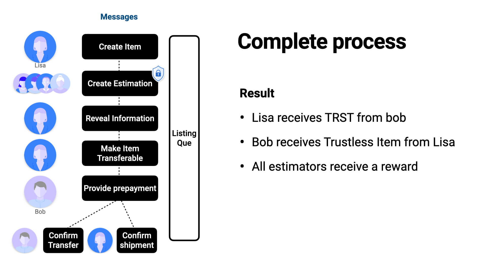
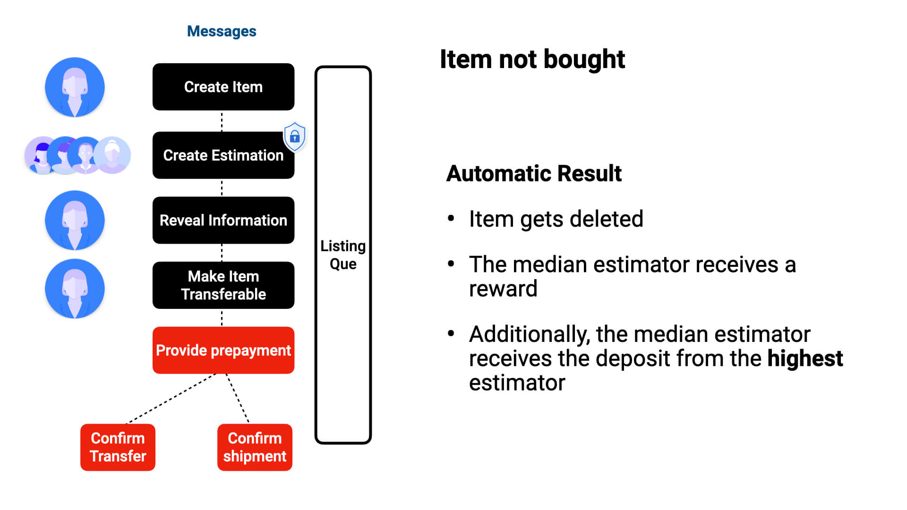
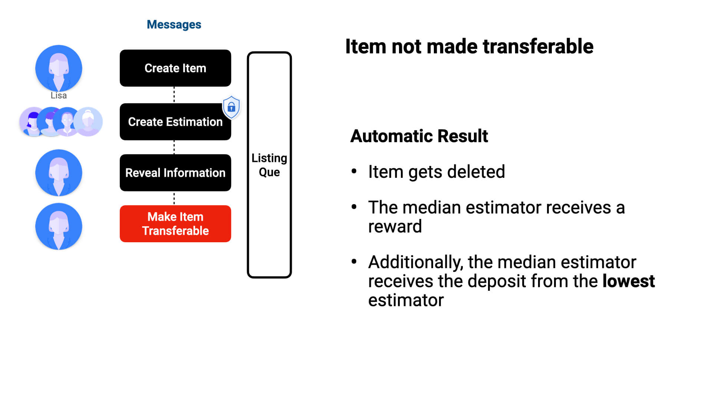

# High-level overview

Any unqiue item can be transferred with independently generated price, NFTs, real estate and so on.
For these, estimations are encrypted and then sent. These are not revealed during the estimation phase, to allow for estimations to be independent.

*A high-level overview of these processes is as follows:*

#### - Buyers can resell the Item

#### - Or Tokenize it

#### - The automated message resolves issues

