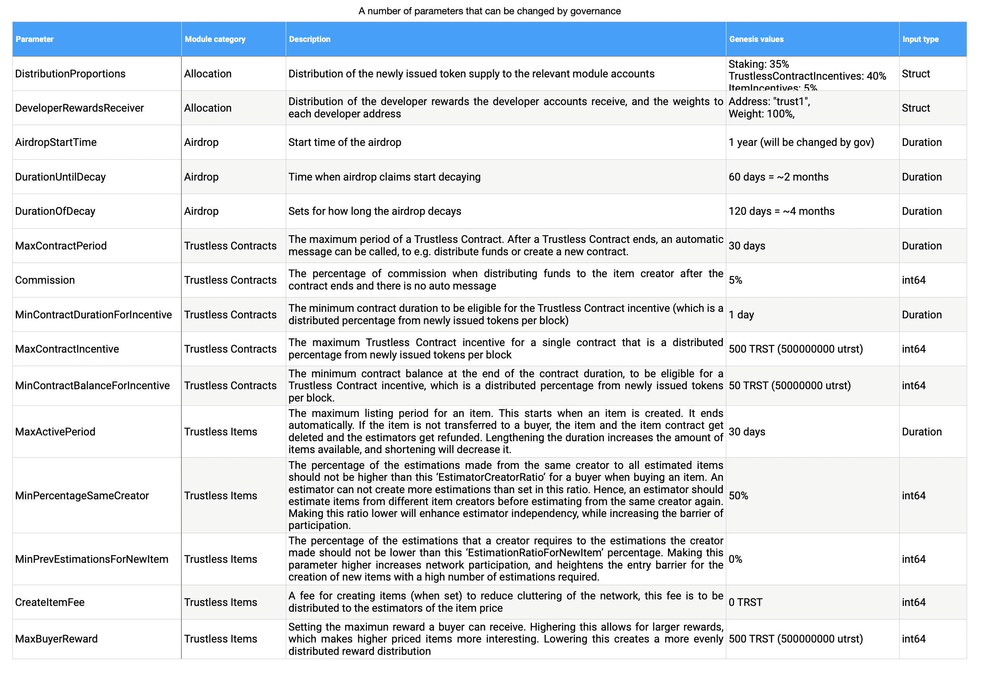

# Governance process

Secondly, parameter changes or software upgrade proposals are technical changes to how the network runs, ideally, that will not halt or disrupt the network in a significant way in terms of downtime.

Examples include but are not limited to:

- how slashing parameters are applied
- how rewards are distributed
- how long the unbonding period is

### Deposit Stage

Anyone can submit a proposal on the Trustless network for others to vote on. The only cost associated with submitting a proposal is the transaction fee, which is as little as 0.000001 TRST. However, over the course of the voting period, a proposal must have at least 512 TRST deposited to it in order for it to proceed to a vote. This voting period is set to be at most 2 weeks, and can be changed though proposals. If the minimum amount of 512 TRST is reached sooner the proposal will pass to voting immediately. 

### Voting Stage

The next stage in the governance process is the voting stage which also lasts 2 weeks. Rather than depositing TRST, participants in this governance stage are actually voting Yes, No, No(With Veto) or Abstain. If a proposal reaches quorum or the minimum threshold defined by the protocol of votes it will pass to the next stage for tallying. Only staked tokens are eligible to be used for governance voting. The amount of voting power is measured in terms of stake. The amount of staked TRST an account has determines how much influence the vote will have on the outcome of a proposal. Further, voters can also change their vote right up until the closing period.

### Tallying Stage

After two weeks the proposal voting will end and the following condition will be taken into consideration to determine if it passes or not:

- Quorum: 
more than 40% of the total staked tokens at the end of the voting period need to have voted
- Threshold: 
More than 50% or a majority of the tokens that participated in the vote, excluding “Abstain” votes must have voted “Yes”
- Veto: 
Less than 33.4% of the tokens that participated in the vote, not counting “Abstain” votes, have vetoed the decision “No (With Veto)”.
If any of these conditions are not met, the deposit associated with the denied proposal will not be refunded. These funds will be sent to the community pool.

Once a parameter change or software upgrade proposal is voted on and passes all conditions it will need to be integrated into a new version of the TRST software by validators while the previous working version continues to run. This is signalling that a switch will occur. Once more than 2⁄3 of the validators download this new version and signal they are ready to make the switch, the rest of the network is expected to do the same.

# TRST-specific parameters

On most blockchains it is  impossible to change make major important strategic changes through direct voting of the community, and we will be a first-mover into this. Next to standard Trustless Hub parameters, such as changing the minimum validator commission fee, amount of validators, unbonding periods, voting periods, we have created 15 additional parameters, of which 10 are directly related to Trustless Contracts and Trustless Items. These are essential for  functioning of the Hub. We believe by having many parameters that can be directly altered through a governance proposal, the Hub will be flexible and adaptable to changes in the environment.  This will ultimately facilitate long-term growth of the Hub.

Above, some of the parameters that can directly be changed through governance proposals