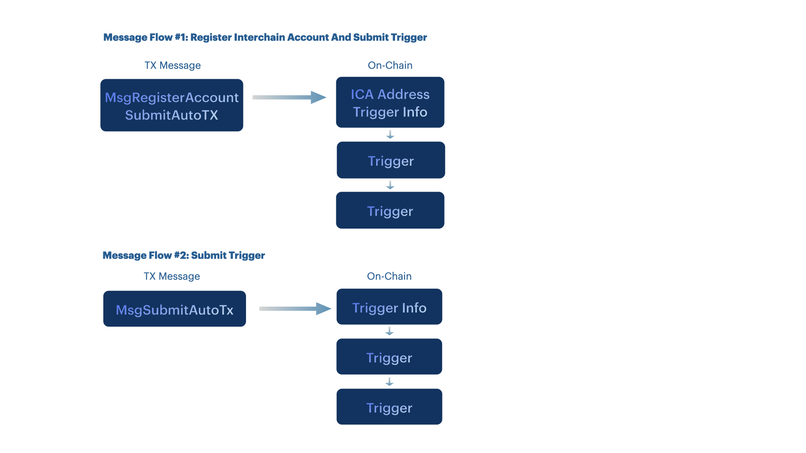

## Setting up Automation

In the previous step we showed how the AutoTX process looks like. We assumed you want to start automation by submitting an AutoTX on Trustless Hub. This can be through the [TriggerPørtal](triggerportal.netlify.app) interface, a TrustlessJS front-end integration or locally through a light client.



However, You can also submit an AutoTX from another chain using the [ICS20 standard](https://github.com/cosmos/ibc-go/blob/main/docs/apps/transfer/messages.md). This is done through ICS20 transfer middleware. ICS20 is an interchain standard that enables the transfer of fungible tokens between independent blockchains within the Cosmos ecosystem. It is a protocol that defines a standard interface for token transfers across different blockchains that implement the Inter-Blockchain Communication (IBC) protocol.


## Using ICS20 Middleware

By specifying AutoTX details in the memo, TRST will submit an AutoTX using the inputs provided. A MsgRegisterAccountAndSubmitAutoTx or a MsgSubmitAutoTx can be derrived from the memo field in the ICS20 transfer message. This is useful for users, entities and contract callers on other chains. This way DAOs and other entities can create AutoTXs using an ICS20-standard transaction.

Our custom middleware is loosely based on the wasmhooks implementation on [Osmosis](https://github.com/osmosis-labs/osmosis/tree/main/x/ibc-hooks).

The mechanism enabling this is a `memo` field on every ICS20 transfer packet as of [IBC v3.4.0](https://medium.com/the-interchain-foundation/moving-beyond-simple-token-transfers-d42b2b1dc29b).
ics_middleware.go is IBC middleware that parses an ICS20 transfer, and if the `memo` field is of a particular form, creates a trigger by parsing and handling a SubmitAutoTx message.

We now detail the fields format for `auto_tx`.

* Owner: This field is directly obtained from the ICS20 packet metadata and equals the ICS20 recipient. If unspecified, a placeholder is made from the ICS20 sender and channel.
* Msg: This field should be directly obtained from the ICS20 packet metadata.
* FeeFunds: This field is set to the amount of funds being sent over in the ICS20 packet. One detail is that the denom in the packet is the counterparty chains representation of the denom, so we have to translate it to TRST's representation.

So our constructed message for MsgSubmitAutoTx will contain the following:

```go
msg := MsgSubmitAutoTx{
 // If let unspecified, owner is the actor that submitted the ICS20 message and a placeholder only
 Owner: packet.data.memo["auto_tx"]["owner"] OR "trust1-hash-of-channel-and-sender",
 // Array of Msg json encoded, then transformed into a proto.message
 Msgs: packet.data.memo["auto_tx"]["msgs"],
 // Funds coins that are transferred to the owner
 FeeFunds: sdk.NewCoin{Denom: ibc.ConvertSenderDenomToLocalDenom(packet.data.Denom), Amount: packet.data.Amount}
```

### ICS20 packet structure

So given the details above, we propogate the implied ICS20 packet data structure.
ICS20 is JSON native, so we use JSON for the memo format.

```json
{
    //... other ibc fields that we don't care about
    "data":{
       "denom": "denom on counterparty chain (e.g. uatom)",
        "amount": "1000",
        "sender": "...", 
        "receiver": "A TRST addr prefixed with trust1",
         "memo": {
           "auto_tx": {
            "owner": "trust1address", //optional
              "msgs": [{
                "@type":"/cosmos.somemodule.v1beta1.sometype",
                //message values in JSON format
            }],
            "duration":"111h",
            "interval":"11h",
            "start_at":"11h",
            "label":"my_label",
            "connection_id":"connection-0", //optional, omit or leave blank in case local TRST message.
            "register_ica": "false"//optional, set to true to register interchain account
        },
        //"version":""//optional, will attempt to register account when filled (this will never override any existing ICA address)
    }
}
}
```

An ICS20 packet is formatted correctly for submitting an auto_tx if the following all hold:

* `memo` is not blank
* `memo` is valid JSON
* `memo` has at least one key, with value `"auto_tx"`
* `memo["auto_tx"]` has exactly the entries mentioned above
* `memo["auto_tx"]["msgs"]` is an array with valid JSON SDK message objects with a key "@type" and sdk message values
* `receiver == memo["auto_tx"]["owner"]`. Optional, owner is the address that receives remaining fee balance after execution ends.
* `memo["auto_tx"]["connection_id"]`is a valid connectionID on TRST -> Destination chain, or blank/empty for local TRST execution of the message.
* `memo["auto_tx"]["register_ica"]` can be added, and true to register an ICA.

Fees are paid with a newly generated and AutoTX specific fee account.

If an ICS20 packet does not contain a memo containing "auto_tx", a regular MsgTransfer takes place.
If an ICS20 packet is directed towards AutoTX, and is formated incorrectly, then it returns an error.

## DAO Integration


Using ICS20 to setup a trigger on Trustless Hub is for advanced users that are familiar with terms such as DAODAO, ICS20 transfers, Authz and FeeGrant.

Our ICS20 middleware is developped to allow DAOs to perform time-based actions, on both their chain and other destination chains. There are several caveats to using ICS20 to set up a trigger. Most use cases require not one but two transactions on the source chain to set up the trigger. One proposal to set the trigger and another to set permissions/send funds to the account on the destination chain.

To demonstrate how DAOs can integrate with Trustless Hub we explain the process using an example.

`DAO` wants to pay `Service provider ABC` for their services that they provide on a monthly basis in `TOKEN1` and holds `TOKEN2` and `JUNO`.

*Service provider ABC invoice example*


In this example a `DAO` on DAODAO triggers a swap of TOKEN2 for TOKEN1 on dex "DEX"  on a recurring basis. 
Then it can automatically send these tokens to "service provider ABC.
This is a neat use case for Trustless Triggers as it requires movement from assets between chains and accounts.
This can be be automated securely using Trustless Hub's Interchain Automation solution. No trusted third paries are used for the swaps.

The tokens to send can remain in control of the DAO. Execution is done by a trigger coming from a placeholder account on Trustless Hub.

For this invoice example we have the following proposal name and description:

*Proposal name*

```md
[Trigger] Pay service provider ABC in TOKEN1
```

*Description*

```md
Submit a trigger to send TOKEN1 to "service provider ABC"

This will swap on a recurring basis TOKEN2 for TOKEN1 on dex "DEX" on Destination Chain and send these tokens to "service provider ABC" 
This will swap TOKEN1 for TOKEN2 on a recurring basis so that:
- the selling pressure on TOKEN2 is gradual
- we maintain a positive cash flow

This Trigger on Trustless Hub allows us to automate asset workflows. It allows our DAO to maintain positive cashflow and have better liquidity.
```

Having adequate liquidity is crucial to ensure smooth operations and financial stability. It enables you to fulfill your financial obligations to suppliers, lenders, and other stakeholders, which strengthens your credibility and reputation in the marketplace. With sufficient liquidity, you can easily pay for bills and expenses, invest in growth opportunities, and effectively manage your DAO's resources. Thus, prioritizing and managing liquidity effectively can help you achieve long-term success and sustainable growth.

## 1. Submitting AutoTX


Submit a proposal with a custom message to execute. For a CosmWasm-based DAO like a [DAO DAO](https://daodao.zone/) DAOs on Juno. This message contains the ICS20 message`MsgTransfer`. In the `memo` you provide the `SubmitAutoTx` execution details such as the message to automate and other parameters.

Below is how the message could look like for a DAO on Juno:

```json
[
  {
    "stargate": {
      "typeUrl": "/ibc.applications.transfer.v1.MsgTransfer",
      "value": {
        "source_port": "transfer",
        "source_channel": "channel-juno__trustless_hub",
        //token should be IBC-denominated TRST, which is used to pay for fees
        "token": "ibc/....", 
        // sender - a bech32 address on source chain
        "sender": "juno1validbech32address",
        // the recipient address on Trustless Hub
        // is replaced with a newly generated address when auto_tx["owner"] in memo is blank
        "receiver": "trust1address",
        // Timeout height relative to the current block height.
        // The timeout is disabled when set to 0.
        "timeout_height": "0",
        // Timeout timestamp in absolute nanoseconds since unix epoch.
         // The timeout is disabled when set to 0.
        "timeout_timestamp": "0",
        "memo": {
           "auto_tx": {
            //owner is optional and should equal recipient
            "owner": "trust1address", 
              "msgs": [{
                "@type":"/someprefix.somemodule.someversion.sometype",
                //add message values 
                //in JSON format
            }],
             //duration from now or start_at. s=seconds, m=minutes, h=hours
            "duration":"111h",
            "interval":"11h",
            //start_at is optional, in nanoseconds since UNIX epoch
            "start_at":"1677841601",
            //label is optional 
            "label":"my_label",
            //connection_id is optional, omit or leave blank in case local Trustless Hub message.
            "connection_id":"connection-0", 
            //register_ica is optional, set to true to register interchain account
            "register_ica": "true"
          },
        }
      }
    }
  }
]
```

Here it is important that the `timeout_timestamp` or `timeout_height` takes into account the proposal's end time. Alternatively both of the timeout values can be set to `0`.

Further it is important that the field `register_ica` is set to `"true"` the first time you create an AutoTX.

A message in `auto_tx["msgs"]` can be like the following MsgSend:

```json
{
  "@type":"/cosmos.bank.v1beta1.MsgSend",
  "amount": [{
    "amount": "70",
    "denom": "stake"
  }],
  "from_address": "ICA_ADDR",
  "to_address": "destination_chain_address"
}
```

For the DAO service provider example, we can have a [SwapAndSendTo](https://github.com/Wasmswap/wasmswap-contracts/blob/main/src/msg.rs#:~:text=%7D%2C-,SwapAndSendTo,-%7B) in a [MsgExecuteContract](https://github.com/CosmWasm/wasmd/blob/main/proto/cosmwasm/wasm/v1/tx.proto) message to swap TOKEN2 for TOKEN1 locally on `Juno`. We can specify the out recipient the recipient's address.

```json
{
    "@type":"/cosmos.authz.v1beta1.MsgExec",
    "msgs": [{
      "@type": "/cosmwasm.wasm.v1.MsgExecuteContract",
      "msg": {
        "swap_and_send_to": {
        "input_token": "TOKEN2",
        "min_token": "500",
        "recipient":"juno1_SERVICEPROVIDER_ABC_ADDR",
        }
       },
      "sender": "juno1_DAO_ADDR", 
      "contract": "juno1_SWAPPAIR_ADDR",
      "funds": []
    }],
    "grantee": "ICA_ADDR", //TIP: leave "ICA_ADDR" as is
}
```

:::tip use ICA_ADDR as a `grantee` or any other field in an AutoTX and Trustless Hub will parse the to-be defined Interchain Account Address. 
:::


Alternatively, we can perform [MsgSwapExactAmountOut](https://github.com/osmosis-labs/osmosis/blob/main/proto/osmosis/gamm/v1beta1/tx.proto#:~:text=message-,MsgSwapExactAmountOut,-%7B) to `Osmosis`  given that there are funds on the DAO's TrustlessHub-Osmosis Interchain Account. To send funds, the DAO can make a proposal for `MsgTransfer` that funds the Trustless Hub Interchain Account. The DAO then controls a trigger on Trustless Hub that controls the swap.  


## 2. Setting Up Permissions and Funds


*Proposal 2 can be the following and should contain the parsed ICA_ADDR, found by querying the interchain account address.* The ICA_ADDR should also have some [funds to execute](#paying-for-fees) and have the proper [permissions](#setting-permissions) set up

:::tip use ICA_ADDR as a `sender` or any other field in an AutoTX and Trustless Hub will parse the to-be defined Interchain Account Address. 
:::

### Sending funds

**On Trustless Hub**

If you want to execute messages locally on Trustless Hub, set `auto_tx["connection_id"]` to `""`.
The funds sent with the ICS20 transfer will be used to pay for all execution fees.

**On Destination Chain**

The `destination_chain_address` should be funded with `destination chain`'s fee token to execute succesfully on `destination chain`.
This can be done by sending tokens directly on `destination chain` by a DAO member.

A trustless approach is available too. You can submit an additional proposal to send `MsgTransfer` to `destination_chain` with the `destination_chain_ica_address` as the receiver.

For the DAO example, a similar proposal to the above can be sent. This does not take a `memo`. Here's an example:

```json
[
  {
    "stargate": {
      "typeUrl": "/ibc.applications.transfer.v1.MsgTransfer",
      "value": {
        "source_port": "transfer",
        "source_channel": "channel_source_chain__destination_chain",
        "token": "IBC/XZY", 
        "sender": "dao_address",
        "receiver": "destination_chain_ica_address",
        "timeout_height": "0",
        "timeout_timestamp": "0",
         "connection_id":"connection-0123", 
      }
    }
  }
]

```

:::tip Alternatively, if the destination chain is the same as the source chain, the DAO can create a FeeGrant for the `destination_chain_ica_address`.
:::

### Setting permissions

Alternatively, you can create a FeeGrant for the `destination_chain_ica_address` when the DAO is present on destination chain. You can also allow the ICA address to execute transactions for the DAO using `AuthZ`. [Here](https://blog.cosmos.network/secret-powers-what-are-the-authz-and-fee-grant-modules-c57d0e808794) is an article explaining the power of both `FeeGrant` and `AuthZ`.

Doing this locally on Juno would look like the following:

 1. Message 1: Submit AutoTX on Trustless Hub.  In the memo, `msgs` should contain AuthZ's MsgExec with `MsgExecuteContract`.
 2. Message 1: Allow the DAO's JUNO tokens to be used for fees by `destination_chain_ica_address` with a FeeGrant.  
 Message 2: AuthZ grant to execute `MsgExecuteContract`.

 For a DAO swapping tokens on a recurring basis on Osmosis, 2 proposals should be made.

 1. Message 1: Submit AutoTX on Trustless Hub. In the memo, `msgs` should contain AuthZ's MsgExec with `MsgSwapExactAmountOut`
 2. Message 1: Send OSMO tokens to using `MsgTransfer` to `destination_chain_ica_address`.  
 Message 2: AuthZ grant to execute `MsgSwapExactAmountOut`.

<!-- FeeGrant typeURL:  `/cosmos.feegrant.v1beta1.Grant`
AuthZ typeURL: `/cosmos.authz.v1beta1.MsgGrant` -->

Setting up a trigger from a chain to another chain is a lengthy process and difficult to understand for end-users. By creating abstractions of the actions in DAODAO, the process can be simplified. 

## 3. Triggers


On [TriggerPortal](https://triggerportal.netlify.app/), you can view, manage and create triggers.


